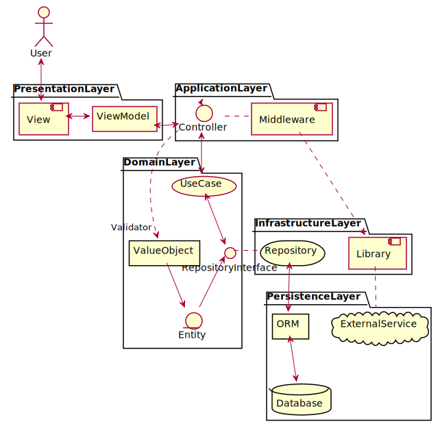

# Spring Boot + Active JDBC DDD Startar

[Spring Boot](https://spring.io/projects/spring-boot) starter project with Domain Driven Development (DDD) using [ActiveJDBC](https://javalite.io/activejdbc) (ActiveRecord Architecture). It also supports transactions.

Since ActiveJDBC is used, redundant Data Access Objects and Data Transfar Objects are not required. Instead, you need to perform [instrumentation](https://javalite.io/instrumentation) when the database changes.

The presentation layer is not included as this project is intended for use with api server. If you want to make a classic web app, please install the template engine (such as [Pebble Template](https://pebbletemplates.io/)) separately.

## License

Licensed under the [MIT](LICENCE) License.

&copy; 2020 [Logue](https://logue.dev/) / [Fores Inc.](https://www.fores.jp/)
